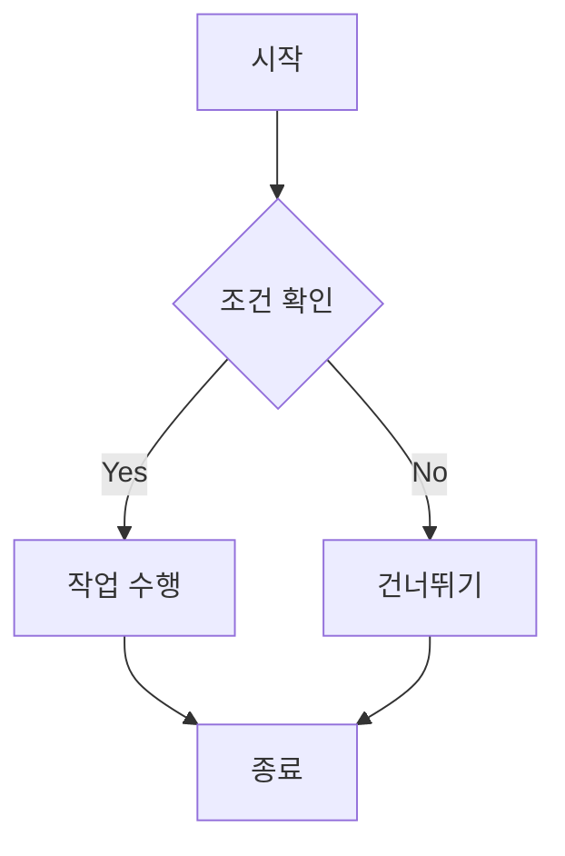
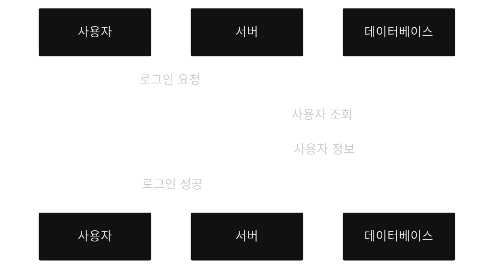
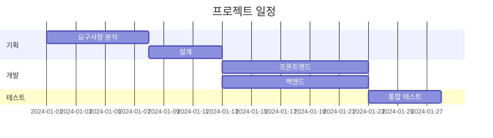

## 텍스트 서식

**굵은 글씨**, *기울임*, ***굵은 기울임***, ~~취소선~~, <u>밑줄</u>

## 제목 계층

### H3 제목
#### H4 제목
##### H5 제목

## 프롬프트 (알림 상자)

> 기본 정보를 표시하는 프롬프트입니다.
{: .prompt-info }

> 유용한 팁이나 도움말을 제공합니다.
{: .prompt-tip }

> 주의해야 할 사항을 알립니다.
{: .prompt-warning }

> 위험하거나 중요한 경고를 표시합니다.
{: .prompt-danger }

## 링크

[인라인 링크](https://jekyllrb.com)

[참조 링크][ref-link]

[ref-link]: https://jekyllrb.com/docs/posts/

## 이미지

{: width="700" height="400" }
_이미지 캡션 예시, (Generated by Gemini2.5 Pro)_

## 코드 블록

### 인라인 코드
`inline code` 예시입니다.

### 파일명이 있는 코드 블록

```python
# hello.py
def hello(name: str) -> str:
    """간단한 인사 함수"""
    return f"Hello, {name}!"

print(hello("world"))
```
{: file="hello.py" }

### 줄 번호가 있는 코드

```javascript
// 줄 번호 자동 표시
function fibonacci(n) {
  if (n <= 1) return n;
  return fibonacci(n - 1) + fibonacci(n - 2);
}

console.log(fibonacci(10));
```

## 리스트

### 순서 없는 리스트
- 항목 1
  - 하위 항목 1-1
  - 하위 항목 1-2
- 항목 2
- 항목 3

### 순서 있는 리스트
1. 첫 번째
2. 두 번째
3. 세 번째

### 체크리스트
- [x] 완료된 작업
- [x] 완료된 작업 2
- [ ] 진행 중인 작업
- [ ] 예정된 작업

## 표 (Table)

| 이름   | 나이  |     직업 |
| :----- | :---: | -------: |
| 홍길동 |  25   |   개발자 |
| 김철수 |  30   | 디자이너 |
| 이영희 |  28   |   기획자 |

## 수학 수식

인라인 수식: $E = mc^2$

블록 수식:

$$
\int_{a}^{b} f(x) \, dx = F(b) - F(a)
$$

## Mermaid 다이어그램

### 플로우차트



### 시퀀스 다이어그램



### 간트 차트



## 동영상 삽입



## 각주

여기에 각주를 추가합니다[^footnote]. 다른 각주도 추가할 수 있습니다[^fn-nth-2].

[^footnote]: 첫 번째 각주 내용입니다.
[^fn-nth-2]: 두 번째 각주 내용입니다.

## 접이식 섹션

<details>
<summary>클릭하여 내용 보기</summary>

숨겨진 내용이 여기에 표시됩니다.

```python
print("접이식 섹션 안의 코드")
```

</details>

## 파일 트리

```
project/
├── src/
│   ├── main.py
│   └── utils.py
├── tests/
│   └── test_main.py
└── README.md
```

## 키보드 입력 표시

<kbd>Ctrl</kbd> + <kbd>C</kbd>를 눌러 복사하세요.

## 역링크 (Reverse Footnote)

이 문서는 Jekyll의 Chirpy 테마[^chirpy]를 사용합니다.

[^chirpy]: [Chirpy GitHub Repository](https://github.com/cotes2020/jekyll-theme-chirpy)

## 참고 자료

- [Jekyll 공식 문서](https://jekyllrb.com/docs/)
- [Chirpy 테마 데모](https://chirpy.cotes.page/)
- [Markdown 가이드](https://www.markdownguide.org/)
- [Chirpy 테마 게시글 작성 가이드](https://jekyllrb.com/docs/posts/)

## 참고

[Chirpy테마 게시글 작성 가이드](https://jekyllrb.com/docs/posts/)
